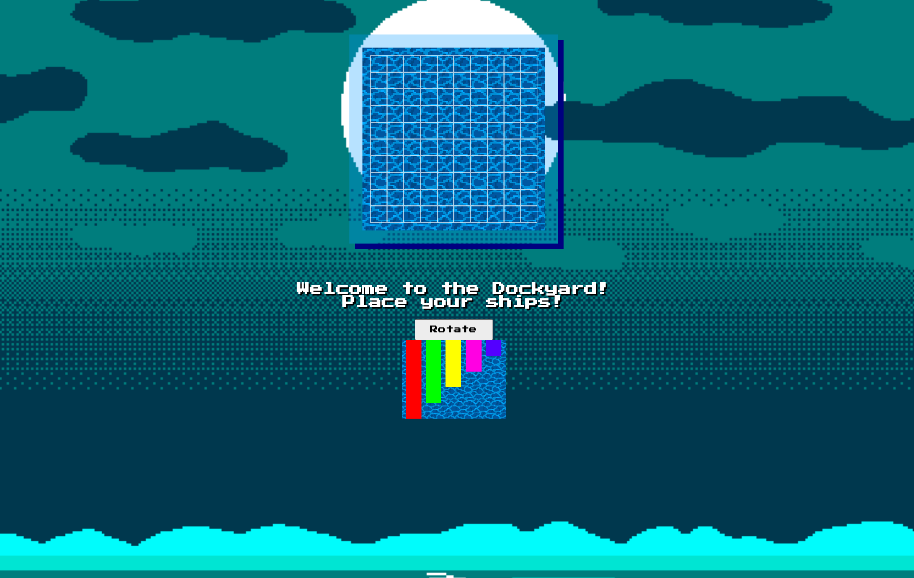
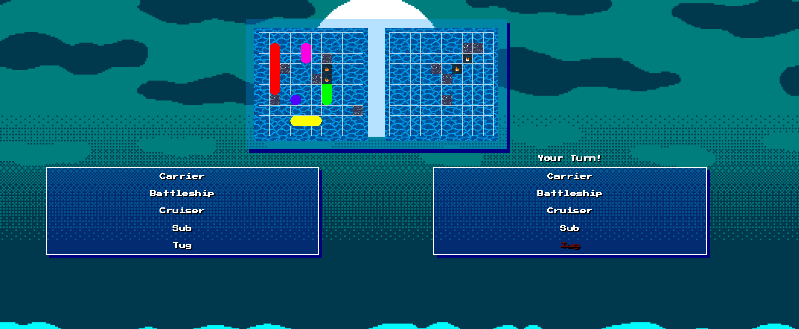
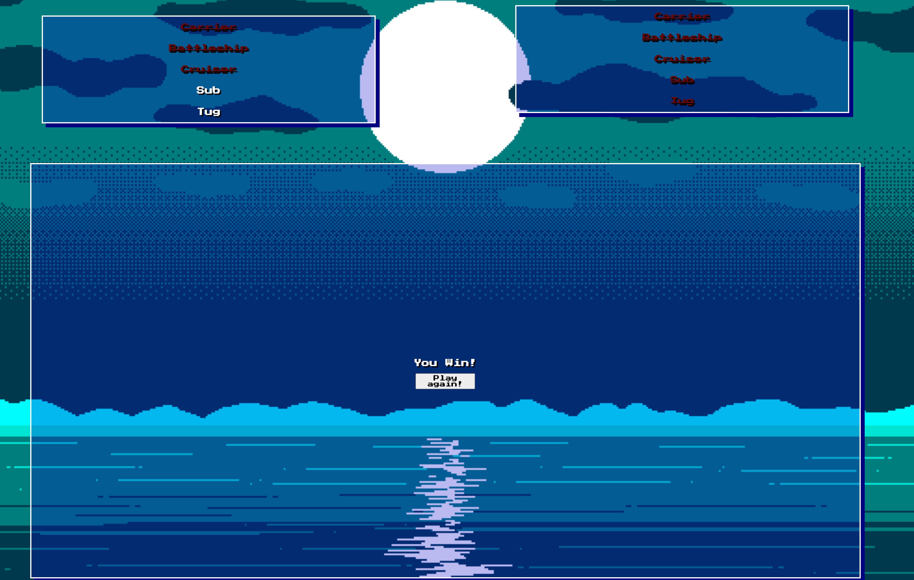

# Battleships

A solo coded project in pure Javascript. 

We were given the task to choose from a set of grid-based games that could utilise array-based logic and a semi-intelligent computer opponent. 

I took on the task of creating Battleships, one of the two 3/3 difficult games set out by our course instructor. 

## 8-Bit Battleships

Based on the classic board game this iteration of Battleships is a grid-based game where you seek to destroy your opponent's ships before they can destroy yours. 

### The Brief 

* Render a game in the browser
* Design logic for winning & losing
* Clean and effective code employing the D.R.Y principles
* Deploy your code 
* Best practices including semantic tags

### Technologies Used

* HTML5 & CSS
* Javascript
* Git & GitHub

## The Project

To start this project I set out to whiteboard and sudo code the key elements before writing any code. This allowed me to identify key areas where my knowledge was potentially lacking and needed to dedicate some time to research the concepts I would need. 

### Logic needed

In my whiteboarding session I identified these areas I would need to get my MVP: 

* Generate two grids, one for the user to place their ships and one auto-generated for the computer's selection 
* A 'ship-yard' that allows the player to see their ships then drag them onto their board 
* A logic defined game boundary to stop both the users and computers ships going out of bounds
* A turn-based system that allowed user input followed by computer choice
* Smart decisions from the computer. Meaning they base their next decision on the result of the previous

## The Grid

The logic for creating the grid is contained solely within one function. This one function is based on the value of the width, in this case, the width is given a value of 10 to create a 10x10 grid. It runs through two forEach's which in turn create a player grid and a computer grid. 

```javascript
function createBoard() {
  width = 10
  const divArray = []

  for (let i = 0; i < width ** 2; i++) {
    divArray.push(i)
  }

  divArray.forEach((cell) => {
    const div = document.createElement('div')
    div.classList.add('mapSquarePc')
    pcMap.appendChild(div)
    div.setAttribute('id', `${cell}`)
    div.setAttribute('data-id', `${cell}`)
  })

  divArray.forEach((cell) => {
    const div = document.createElement('div')
    div.classList.add('mapsquare')
    playerMap.appendChild(div)
    div.setAttribute(`id`, `${cell}`)
    div.setAttribute('data-id', `${cell}`)
  })
  playerCells = document.querySelectorAll('.mapsquare')
  pcCells = document.querySelectorAll('.mapSquarePc')
}


```

### Computer Placement

When doing the whiteboarding, I had anticipated that the computer placement would be relatively easy. However, I faced more of a challenge than originally thought. 

There were two key areas that caused a challenge. Firstly and most important was ensuring that the ships did not overlap on each other or go out of bounds. Secondly was to make sure that there was enough variation in the direction chosen to increase the difficulty for the player. 

The code below solves both issues, it does this by wrapping a for loop inside a while loop to check for all conditions. 

```javascript


function computerStart() {
  pcCells = Array.from(pcCells)
  pcProfile.ships.forEach((ship) => {
    let placed = false
    while (placed === false) {
      const randomAxis = Math.floor(Math.random() * 2)
      let direction = 0
      if (randomAxis === 0) {
        direction = 1
      } else {
        direction = 10
      }
      const randomStart = Math.abs(Math.floor(Math.random() * pcCells.length - (ship.length * direction) - 1))

      const shipArray = []
      for (let i = 0; i < ship.length; i++) {
        shipArray.push(Number(pcCells[(randomStart + (direction * i))].id))
      }

      const dissallowedCells = [9, 19, 29, 39, 49, 59, 69, 79, 89, 99, 1, 2, 3, 4, 5, 6, 7, 8]

      const confirmCell = shipArray.some(r => dissallowedCells.indexOf(r) >= 0)
      const isTaken = shipArray.some(r => isNaN(r))
      if (!isTaken && !confirmCell) {
        for (let i = 0; i < ship.length; i++) {
          pcCells[(randomStart + (direction * i))].setAttribute('id', `${ship.name}`)
          pcCells[(randomStart + (direction * i))].classList.add('taken')
        }
        placed = true
      } else {
        placed = false
      }
    }
  })
}


```

### User placement 

The user placement took a large proportion of my time in this project. This is because I wanted to implement drag and drop in pure javascript. 

I split this into 3 key areas. drag start, dragging and drag-drop. 

The bulk of the code sat inside drag-drop which ran all the calculations for how long the ship was, the cells it wasn't allowed in and if a ship was already placed there. After all, checks are passed it then removes it from the boatyard and places it on the board. 

```javascript

const shipNameWithLastId = draggedShip.lastChild.id
    const shipClass = shipNameWithLastId.slice(0, -1)
    const targetSquare = Number(this.id)
    const widthCorrection = width * selectedShipCurrentId
    const lengthCorrection = width + selectedShipCurrentId
    const dissallowedCells = [9, 19, 29, 39, 49, 59, 69, 79, 89, 99, 1, 2, 3, 4, 5, 6, 7, 8]

    let potentialShipArr = []
    if (!horizontal) {
      for (let i = 1; i < draggedShipLength + 1; i++) {
        potentialShipArr.push(Number(playerCells[(targetSquare - width) + ((width * i)) - widthCorrection].id))
      }
    } else {
      for (let i = 1; i < draggedShipLength + 1; i++) {
        potentialShipArr.push(Number(playerCells[(targetSquare - selectedShipCurrentId) + ((i - 1))].id))
      }
    }

    const confirmCell = potentialShipArr.some(r => dissallowedCells.indexOf(r) >= 0)

    if (!confirmCell) {
      if (horizontal) {
        for (let i = 1; i < draggedShipLength + 1; i++) {
          playerCells[(targetSquare - width) + ((width * i)) - widthCorrection].setAttribute('id', `${shipClass}${i - 1}`)
          playerCells[(targetSquare - width) + ((width * i)) - widthCorrection].classList.add('taken')
        }
      } else {
        for (let i = 1; i < draggedShipLength + 1; i++) {
          playerCells[(targetSquare - selectedShipCurrentId) + ((i - 1))].setAttribute('id', `${shipClass}${i + 4}`)
          playerCells[(targetSquare - selectedShipCurrentId) + ((i - 1))].classList.add('taken')
        }
      }
    } else {
      return
    }
    boatYard.removeChild(draggedShip)

    if (boatYard.childNodes.length === 0) {
      const yard = document.querySelector('#boat-yard')
      pcCells.forEach(cell => cell.classList.add('mapSquarePc'))
      pcMap.classList.add('pcmap')
      yard.remove()
      textYourTurn.classList.remove('disabledtext')
      playerScoreBox.classList.remove('disabled')
      playerScoreBox.classList.add('playerSunkShips')
      pcScoreBox.classList.remove('disabled')
      pcScoreBox.classList.add('pcSunkShips')
    }
  }


```



The challenge faced with this is that it can cause some errors if the ships aren't placed directly inside the cell on the board. 


## The Computer's Turn 

Until the computer hits a ship it's moves are purely random. 

Once a ship has been hit I wanted to have my computer make a relatively sensible decision. 

It will track the cell it has hit and then search the surrounding cells till it locks into a direction and then follows that until either the ship is sunk or it hits the water. If it hits the water it will then go back the first cell and try the opposite direction. 

```javascript 
 if (!targetCell.classList.contains('miss') && !targetCell.classList.contains('hit')) {
        canGo = true
        if (playerCells[randomCell].classList.contains('taken')) {
          targetCell.removeAttribute(`id`)
          targetCell.classList.remove('ships')
          targetCell.classList.add('hit')
          firstHitValue = parseInt(targetCell.dataset.id)
          playerHit(PlayerCellShip)
        } else {
          targetCell.classList.add('miss')
        }
      } else {
        canGo = false
      }


    } else if (firstHitValue !== null && lastAttemptValue === null) {
      if (firstHitValue < 10) {
        directionArray.shift()
        let secondattempt = playerCells[firstHitValue + directionArray[0]]
        if (!secondattempt.classList.contains('miss') && !secondattempt.classList.contains('hit')) {
          canGo = true
          if (secondattempt.classList.contains('taken')) {
            PlayerCellShip = (secondattempt.id).substr(0, secondattempt.id.length - 1)
            secondattempt.removeAttribute(`id`)
            secondattempt.classList.remove('ships')
            secondattempt.classList.add('hit')
            lastAttemptValue = secondattempt.dataset.id
            playerHit(PlayerCellShip)
            if(PlayerCellShip === 'Tug'){
              resetTargeting()
            }
          } else {
            lastAttemptValue = 'missed'
            secondattempt.classList.add('miss')
            directionArray.shift()
          }
        } else {
          directionArray.shift()
        }

      } else if (firstHitValue > 89) {
        directionArray.pop()
        secondattempt = playerCells[firstHitValue + directionArray[0]]
        if (!secondattempt.classList.contains('miss') && !secondattempt.classList.contains('hit')) {
          canGo = true
          if (secondattempt.classList.contains('taken')) {
            PlayerCellShip = (secondattempt.id).substr(0, secondattempt.id.length - 1)
            secondattempt.removeAttribute(`id`)
            secondattempt.classList.remove('ships')
            secondattempt.classList.add('hit')
            lastAttemptValue = parseInt(secondattempt.dataset.id)
            playerHit(PlayerCellShip)
          } else {
            lastAttemptValue = 'missed'
            secondattempt.classList.add('miss')
            directionArray.shift()
          }
        } else {
          directionArray.shift()
        }

      } else {
        secondattempt = playerCells[firstHitValue + directionArray[0]]
        if (!secondattempt.classList.contains('miss') && !secondattempt.classList.contains('hit')) {
          canGo = true
          if (secondattempt.classList.contains('taken')) {
            PlayerCellShip = (secondattempt.id).substr(0, secondattempt.id.length - 1)
            secondattempt.removeAttribute(`id`)
            secondattempt.classList.remove('ships')
            secondattempt.classList.add('hit')
            lastAttemptValue = parseInt(secondattempt.dataset.id)
            playerHit(PlayerCellShip)
          } else {
            lastAttemptValue = 'missed'
            secondattempt.classList.add('miss')
            directionArray.shift()
          }
        } else {
          directionArray.shift()
        }
      }


    } else if (firstHitValue !== null && lastAttemptValue === 'missed') {
      secondattempt = playerCells[firstHitValue + directionArray[0]]
      if (!secondattempt.classList.contains('miss') && !secondattempt.classList.contains('hit')) {
        canGo = true
        if (secondattempt.classList.contains('taken')) {
          PlayerCellShip = (secondattempt.id).substr(0, secondattempt.id.length - 1)
          secondattempt.removeAttribute(`id`)
          secondattempt.classList.remove('ships')
          secondattempt.classList.add('hit')
          lastAttemptValue = parseInt(secondattempt.dataset.id)
          playerHit(PlayerCellShip)
        } else {
          lastAttemptValue = 'missed'
          secondattempt.classList.add('miss')
          directionArray.shift()

        }
      } else {
        directionArray.shift()
      }


    } else if (firstHitValue !== null && !isNaN(lastAttemptValue)) {
      thirdattempt = playerCells[lastAttemptValue + directionArray[0]]
      if (!thirdattempt.classList.contains('miss') && !thirdattempt.classList.contains('hit')) {
        canGo = true
        if (thirdattempt.classList.contains('taken')) {
          PlayerCellShip = (thirdattempt.id).substr(0, thirdattempt.id.length - 1)
          thirdattempt.removeAttribute(`id`)
          thirdattempt.classList.remove('ships')
          thirdattempt.classList.add('hit')
          lastAttemptValue = parseInt(thirdattempt.dataset.id)
          playerHit(PlayerCellShip)
        } else {
          lastAttemptValue = 'missed'
          directionArray.shift()
          thirdattempt.classList.add('miss')
        }
      } else {
        directionArray.shift()
      }
    }
  }
}

```



A big challenge faced here is with ship placement. If the user places ships together while vertical the ai will bug and enter a loop. It will be a relatively easy fix but one I ran out of time to implement. 



## Overall 

### Stretch Goals 

1. Fix computer firing bug, so users can place ships next to each other
2. Add responsive features
3. Add difficulty levels 


### Key learnings

This project was a massive learning experience. It was my first project of the Bootcamp and choosing a level 3 difficulty I faced a lot of challenges but learnt an incredible amount. 

Using pure javascript to create the entire game was a very rewarding experience and has forever changed how I face problems and planning for a project. As mentioned above there is one key bug that I will need to solve when the AI is choosing its next target. 

My key learnings for this project: 

1. Managing my time is key. Having a list of features to focus on in order is important
2. Looking for key resources to help with certain bugs 
3. Aim for the MVP and work from there 